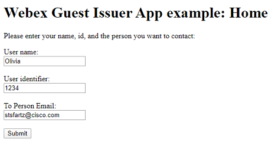
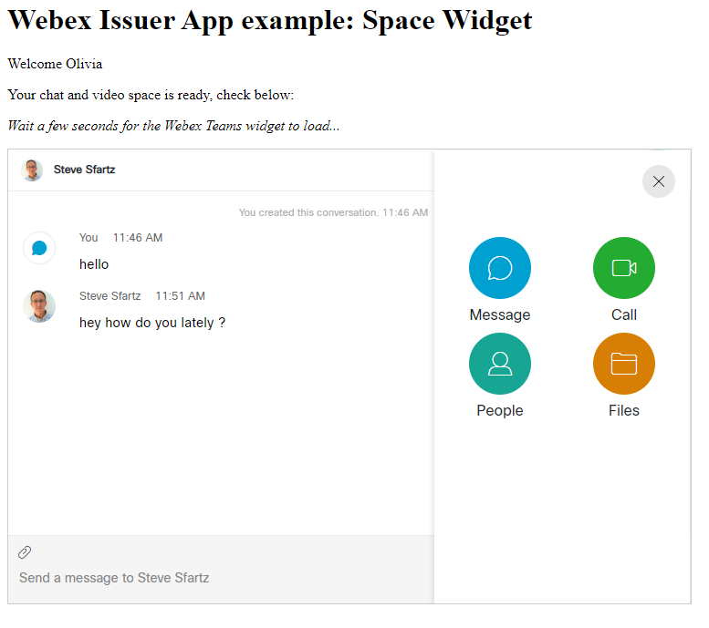

# Example of Webex Guest Issuer App in Node.js

This example illustrates how to create a server-side Webex Guest Issuer application.

For testing purpose, this example leverages a pre-registered Webex Guest Issuer Application.

**If you are part of a Webex paying organization, you can [create your own Guest application](https://developer.webex.com/add-guest.html), and place your Guest Issuer id and secret in [server.js](./server.js#L31)**


## Quick start on Glitch

Click [](https://glitch.com/edit/#!/import/github/ObjectIsAdvantag/guestissuer-lab)

Open the `.env` file and paste the ['Guest Issuer'](https://developer.webex.com/docs/guest-issuer) **identifier and secret** for your application.

Your app is all set.

Click `Show` to run the demo


## Run the sample locally

``` bash
git clone https://github.com/ObjectIsAdvantag/guestissuer-lab
cd guestissuer-lab
npm install
DEBUG=lab* GUEST_ISSUER="XXXXX" GUEST_SECRET="YYYYY" node server.js
```


## Roadmap

- Add a server-side managed session: https://github.com/expressjs/session


## Screenshots

First enter the info for the guest user, and the email of the Webex Teams user you want to contact:


<br/>
<br/>

Then, simply chat, call, share files:


